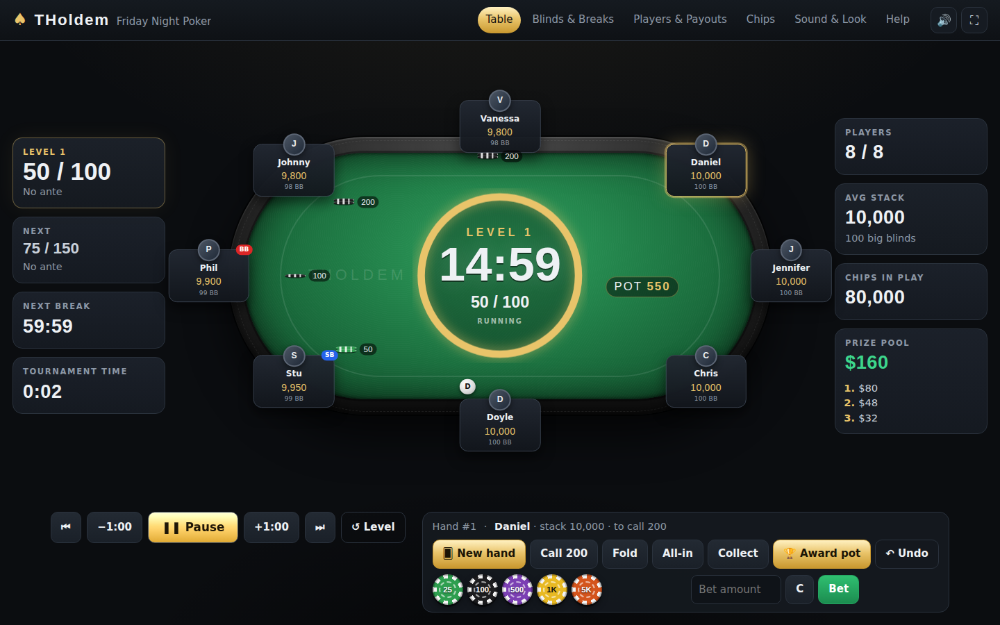

# ♠ THoldem: home tournament clock

THoldem runs a live Texas Hold'em tournament at home: the blind clock, the level announcements, chips, stacks, the pot and the prize money. You still deal real cards with real chips. It runs in any modern browser with no install, no account and no dependencies, and it works offline. Put it on a laptop or a TV next to the table.



## Features

- **Blind clock** with a big countdown on a poker table, start/pause, ±1 minute, next/previous level and a progress ring.
- **Warnings** 5 minutes (configurable) and optionally 1 minute before the blinds go up, with a banner, a chime and a spoken announcement.
- **Level-up takeover** with an original, synthesized 90s-sports-TV style *Prime Time* brass fanfare, and a voice that reads out the new blinds and ante.
- **Breaks** anywhere in the structure, with a colour-up reminder. The clock can pause itself when a break ends.
- **Structure builder**: Home Game / Turbo / Deep Stack / Hyper presets, or a generator (stack depth, speed, level length, breaks, big-blind or classic antes). Every level can be edited inline, even mid-game.
- **Pot tracking at the table**: *New hand* moves the dealer button and posts blinds and antes. Call / check / bet / fold / all-in from a chip tray. Award or split the pot, with side pots and uncalled bets handled automatically, and undo.
- **Players**: 2–12 seats, names, shuffle seats, stack edits, rebuys, add-ons, knockouts with finishing places, and a champion screen.
- **Money**: buy-in, rake, rebuys, add-ons, prize pool and payouts by place.
- **Chips**: your own denominations and colours, auto-distribution of the starting stack, a count of chips needed for the whole table, and a colour-up planner.
- **Sound & look**: 7 built-in sounds or your own uploaded clip for each cue, voice announcements, desktop notifications, keep-screen-awake, 6 felt colours, 3 rails and custom text on the felt.
- **Auto-saves** in the browser (the clock catches up after sleep or a reload). Export and import your setup as JSON.

## Run it

**Easiest:** download the folder and double-click `index.html`.

**Or with a local server** (Node 18+):

```sh
npm start          # then open http://localhost:8080  (PORT=3000 npm start to change the port)
npm test           # engine unit tests
```

Saved data is kept separately for each way of opening the app, so a game started from `index.html` won't appear on `localhost:8080`, and the reverse.

## Quick start

1. **Players & Payouts:** set the number of players, names, buy-in and starting stack.
2. **Blinds & Breaks:** tap a preset (*Home Game* is a good first choice).
3. **Chips:** enter your chip colours and values, then press **Auto-distribute starting stack**.
4. **Table:** press **▶ Start** (or tap the clock, or press Space). For each deal, press **New hand** (`N`) if you want to track bets and the pot.

The **Help** tab in the app is the full guide.

## Keyboard shortcuts

| Key | Action |
| --- | --- |
| `Space` | Start / pause the clock |
| `→` / `←` | Next / previous level |
| `↑` / `↓` | Add / remove one minute |
| `N` | New hand (move the button, post blinds & antes) |
| `C` / `X` | Call-or-check / fold for the selected player |
| `Ctrl`/`⌘` + `Z` | Undo the last table action |
| `F` / `M` | Fullscreen / mute |
| `1`–`6` | Switch tabs |
| `Esc` | Close a pop-up or the level-up card, or cancel awarding the pot |

## Project structure

```
index.html            App shell: tabs, table, controls and settings forms
css/styles.css        All styling (table, chips, overlays, responsive layout)
js/engine.js          Pure logic: blind structures, clock, chips, prize pool, hands & side pots (no DOM, unit-tested)
js/audio.js           Web Audio synth for every sound, custom clip storage (IndexedDB), speech
js/app.js             UI controller: rendering, events, saving, keyboard shortcuts
js/help.js            Content of the in-app Help tab
server.js             Tiny zero-dependency static server for `npm start`
tests/                Automated tests (`npm test` runs the engine unit tests)
*.png                 Screenshots
```

## Known limitations / roadmap

- **One table, 2–12 players.** Multi-table balancing is not supported.
- **No betting-round logic.** THoldem doesn't track streets, minimum raises or whose turn it is. It selects the next player for you, but you're the dealer. A bet amount is *added* to what the player already has in front of them.
- **Data stays in one browser on one device.** Nothing syncs between devices, and a private window forgets everything. *Export* only saves the setup, not a tournament in progress, and it doesn't include uploaded sound clips.
- **Undo** holds the last 40 table actions and is cleared when the page reloads. It doesn't cover the clock.
- **Use one tab.** Every open tab runs the clock and plays the sounds.
- **Browser dependent:** sound starts after the first click or key press, the voices depend on the OS, and keep-awake and notifications need browser support.
- Ideas: a separate display-only view for a second screen, late registration, chip-race helper, payout rounding to whole bills, printable structure sheet.
